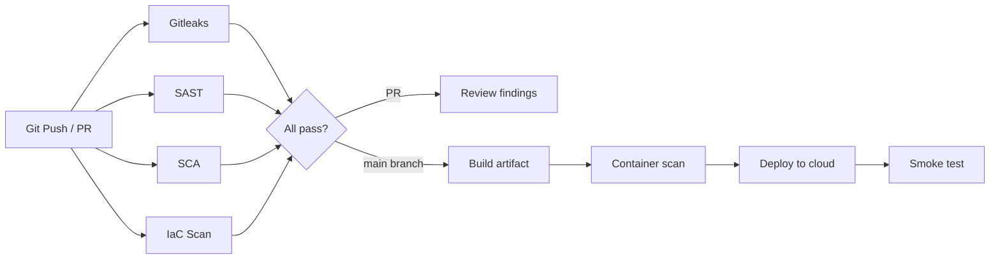

# Cloud Security & DevSecOps Practice Labs

Three end-to-end, hands-on projects for learning **Cloud Security** and **DevSecOps** using **open-source tools**, **Terraform**, **GitHub Actions**, and real cloud deployments.

| Project | Cloud | Architecture | Primary SAST | Primary SCA |
|---------|-------|--------------|--------------|-------------|
| [Project 1](project-1-aws-ecs-devsecops/README.md) | **AWS** | ECS Fargate + ALB + ECR | Semgrep | Trivy |
| [Project 2](project-2-aws-serverless-devsecops/README.md) | **AWS** | Lambda + API Gateway + DynamoDB | Bandit, Semgrep | Trivy, pip-audit |
| [Project 3](project-3-gcp-cloudrun-devsecops/README.md) | **GCP** | Cloud Run + Artifact Registry | Semgrep, ESLint | Trivy, npm audit |

Each project includes:
- Sample application with **intentional security findings** for practice
- **Terraform** infrastructure as code
- **GitHub Actions** CI/CD with security gates
- **Keyless cloud authentication** (AWS OIDC / GCP Workload Identity Federation)
- Step-by-step README with deploy, test, and teardown instructions

---

## What you will learn

- Integrating **SAST** (Static Application Security Testing) into CI/CD
- Running **SCA** (Software Composition Analysis) on dependencies
- Scanning **Infrastructure as Code** before `terraform apply`
- Detecting **secrets** in git history with Gitleaks
- Scanning **container images** before deployment
- Deploying securely to **AWS** and **GCP** without long-lived credentials
- Reading and remediating security tool output (SARIF in GitHub Security tab)

---

## Open-source security tool stack

All tools used in these labs are free and open source:

| Category | Tools |
|----------|-------|
| **Secrets** | [Gitleaks](https://github.com/gitleaks/gitleaks) |
| **SAST** | [Semgrep](https://semgrep.dev/), [Bandit](https://bandit.readthedocs.io/), [ESLint-plugin-security](https://github.com/eslint-community/eslint-plugin-security) |
| **SCA** | [Trivy](https://trivy.dev/), [pip-audit](https://pypi.org/project/pip-audit/), npm audit |
| **IaC** | [Checkov](https://www.checkov.io/), [tfsec](https://aquasecurity.github.io/tfsec/), [KICS](https://docs.kics.io/) |
| **IaC provisioning** | [Terraform](https://www.terraform.io/) |
| **CI/CD** | [GitHub Actions](https://docs.github.com/en/actions) |

---

## Repository structure

```
.
├── .github/workflows/          # GitHub Actions pipelines (monorepo root)
│   ├── project-1-ecs-devsecops.yml
│   ├── project-2-serverless-devsecops.yml
│   └── project-3-gcp-cloudrun-devsecops.yml
├── project-1-aws-ecs-devsecops/
│   ├── app/                  # Flask API + Dockerfile
│   ├── security/             # Custom Semgrep rules
│   ├── terraform/            # AWS VPC, ECS, ECR, ALB, OIDC
│   └── README.md             # Full step-by-step guide
├── project-2-aws-serverless-devsecops/
│   ├── app/                  # Lambda function
│   ├── terraform/            # Lambda, API GW, DynamoDB, S3, OIDC
│   └── README.md
└── project-3-gcp-cloudrun-devsecops/
    ├── app/                  # Express API + Dockerfile
    ├── security/
    ├── terraform/            # Cloud Run, Artifact Registry, WIF
    └── README.md
```

> **Important:** GitHub Actions only reads workflows from `.github/workflows/` at the **repository root**. Each project's README references the corresponding root workflow file.

---

## Quick start (all projects)

### 1. Install prerequisites

```powershell
# Verify installations
aws --version          # AWS CLI v2
gcloud --version       # Google Cloud SDK
terraform version      # >= 1.5
docker version
git --version
```

### 2. Clone and push to GitHub

```powershell
cd "C:\Users\vekis\Desktop\CICD\CloudSec & DevSecOps"
git init
git add .
git commit -m "Initial DevSecOps practice labs"
git remote add origin https://github.com/YOUR_USERNAME/devsecops-labs.git
git branch -M main
git push -u origin main
```

Use one monorepo (`devsecops-labs`) for all three projects, or separate repos (update `github_repo` in each project's `terraform.tfvars`).

### 3. Pick a project and follow its README

| Order | Project | Time estimate | Monthly cost |
|-------|---------|---------------|--------------|
| 1 | [AWS ECS](project-1-aws-ecs-devsecops/README.md) | 2–3 hours | ~$30–50 |
| 2 | [AWS Serverless](project-2-aws-serverless-devsecops/README.md) | 1–2 hours | ~$5–15 |
| 3 | [GCP Cloud Run](project-3-gcp-cloudrun-devsecops/README.md) | 2–3 hours | ~$0–10 |

### 4. Tear down when done

```powershell
# In each project's terraform directory:
terraform destroy
```

---

## CI/CD pipeline pattern (all projects)

Every project follows the same DevSecOps pipeline pattern:



### Security gates on pull requests

- Scans run on every PR — **deployment is blocked** until checks pass
- SARIF results upload to GitHub **Security → Code scanning alerts**
- Fix intentional findings in the sample apps to practice remediation

### Deployment on main branch

- Only runs after all security jobs succeed
- Uses **OIDC** (AWS) or **Workload Identity Federation** (GCP)
- No `AWS_ACCESS_KEY_ID` or GCP JSON key files in GitHub secrets

---

## GitHub configuration reference (monorepo)

Configure these in **Settings → Secrets and variables → Actions** after running `terraform apply` for each project.

### Secrets

| Secret | Project | Source |
|--------|---------|--------|
| `AWS_ROLE_ARN` | Project 1 (ECS) | `terraform output github_actions_role_arn` in project-1 |
| `AWS_ROLE_ARN_SERVERLESS` | Project 2 (Lambda) | `terraform output github_actions_role_arn` in project-2 |
| `GCP_WORKLOAD_IDENTITY_PROVIDER` | Project 3 (GCP) | `terraform output workload_identity_provider` in project-3 |
| `GCP_SERVICE_ACCOUNT` | Project 3 (GCP) | `terraform output github_actions_service_account` in project-3 |

### Variables

| Variable | Project | Example |
|----------|---------|---------|
| `AWS_REGION` | 1, 2 | `us-east-1` |
| `S3_ARTIFACTS_BUCKET` | 2 | `serverless-devsecops-artifacts-123456789` |
| `GCP_PROJECT_ID` | 3 | `my-gcp-project` |
| `GCP_REGION` | 3 | `us-central1` |
| `ARTIFACT_REGISTRY` | 3 | `us-central1-docker.pkg.dev/my-project/cloudrun-devsecops-repo` |

---

## AWS account setup (Projects 1 & 2)

```powershell
aws configure
aws sts get-caller-identity
```

For each AWS project:

```powershell
cd project-1-aws-ecs-devsecops\terraform   # or project-2
copy terraform.tfvars.example terraform.tfvars
# Edit github_org and github_repo
terraform init
terraform apply
```

Copy Terraform outputs into GitHub secrets (see table above).

---

## GCP account setup (Project 3)

```powershell
gcloud auth login
gcloud auth application-default login
gcloud config set project YOUR_PROJECT_ID
```

```powershell
cd project-3-gcp-cloudrun-devsecops\terraform
copy terraform.tfvars.example terraform.tfvars
# Edit gcp_project_id, github_org, github_repo
terraform init
terraform apply
```

Bootstrap the first container image (see Project 3 README Step 5), then configure GitHub secrets.

---

## Recommended learning path

### Week 1 — Foundations
1. Deploy **Project 1** (ECS). Understand the full container pipeline.
2. Run security tools locally (commands in each README).
3. Fix one finding at a time; re-run CI and observe results.

### Week 2 — Serverless & IaC depth
1. Deploy **Project 2** (Lambda). Compare Bandit vs Semgrep output.
2. Experiment with **KICS** IaC findings on DynamoDB and API Gateway resources.
3. Add an API Gateway authorizer as a stretch goal.

### Week 3 — Multi-cloud
1. Deploy **Project 3** (GCP Cloud Run). Compare WIF vs AWS OIDC.
2. Restrict Cloud Run from public (`allUsers`) to authenticated invokers.
3. Document differences in your own runbook.

---

## Cost management

| Resource | Cost driver | Mitigation |
|----------|-------------|------------|
| NAT Gateway (Project 1) | Hourly charge | `terraform destroy` after lab |
| ALB (Project 1) | Hourly charge | Destroy when not in use |
| Fargate (Project 1) | vCPU/memory hours | Set `desired_count = 0` or destroy |
| Lambda (Project 2) | Invocations | Free tier covers labs |
| Cloud Run (Project 3) | Requests + CPU | `min_instance_count = 0` (default) |

**Always run `terraform destroy` when finished.**

---

## Troubleshooting (common)

### GitHub Actions: OIDC / WIF authentication fails

- Ensure `github_org` and `github_repo` in `terraform.tfvars` match your repository **exactly** (case-sensitive).
- Workflow must include `permissions: id-token: write`.

### Security scans fail on intentional demo code

- This is expected on first run. Fix the intentional issues or temporarily adjust `exit-code` in workflows for learning.
- See the "Practice security findings" section in each project README.

### Terraform state conflicts

- Use separate state per project (default: local state in each `terraform/` folder).
- For production, configure remote state (S3 + DynamoDB for AWS, GCS for GCP).

---

## Extending these labs

- Add **OWASP ZAP** DAST stage after deployment
- Integrate **DefectDojo** or **Dependency-Track** for findings aggregation
- Add **OPA/Conftest** policy gates on Kubernetes manifests
- Enable **AWS GuardDuty** / **GCP Security Command Center**
- Replace HTTP with **HTTPS** (ACM / GCP managed certificates)

---

## License

These materials are provided for educational purposes. Sample applications contain intentional insecure patterns — **never deploy them to production without remediation**.

---

## Project documentation

- [Project 1: AWS ECS Fargate DevSecOps](project-1-aws-ecs-devsecops/README.md)
- [Project 2: AWS Serverless Lambda DevSecOps](project-2-aws-serverless-devsecops/README.md)
- [Project 3: GCP Cloud Run DevSecOps](project-3-gcp-cloudrun-devsecops/README.md)
